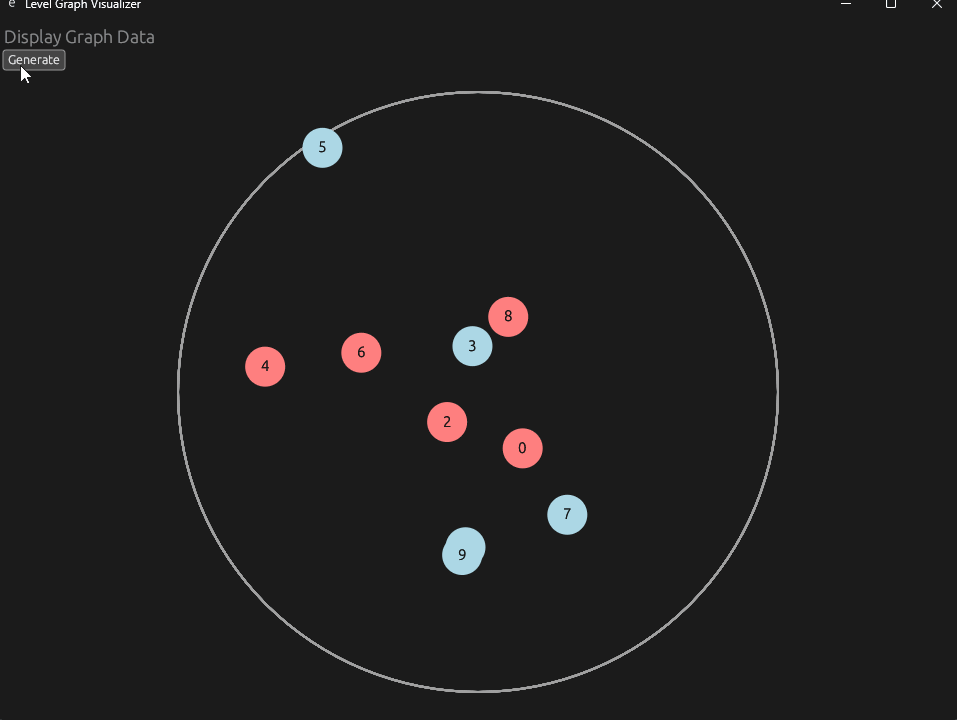
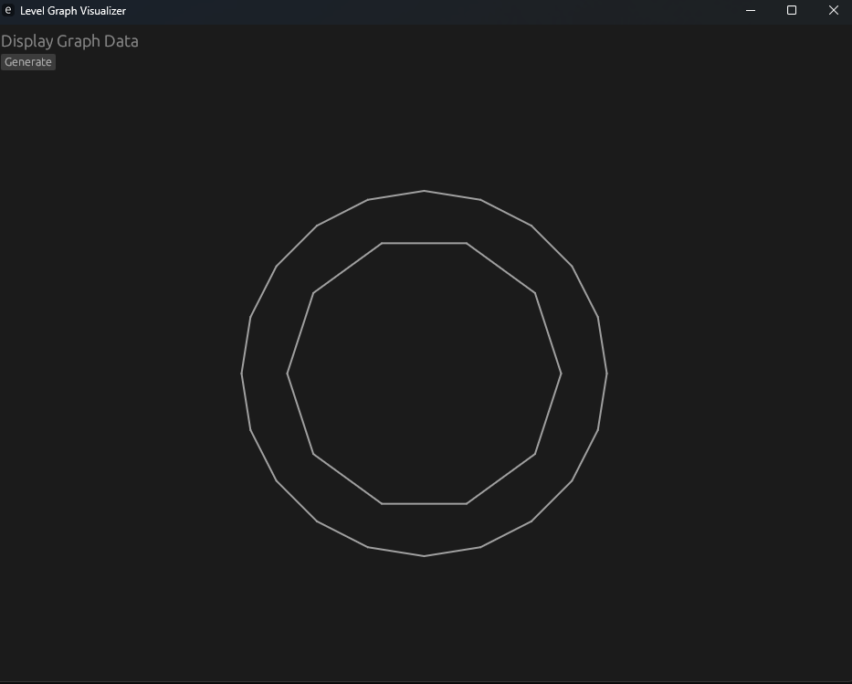

# Level Graph Generator

-Simple Level Generator in Rust using egui for Display

-Each node represent a building

-The nodes have to stay inside the circle and avoid overlapping

## Circle Draw using LineDraw

-"Portable" (In Unity / Roblox / Any Game Engine) function that take a DrawLine function and Draw a Circle for Debugging

